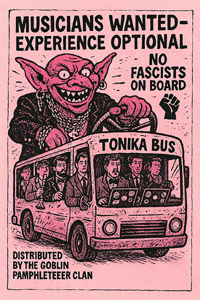
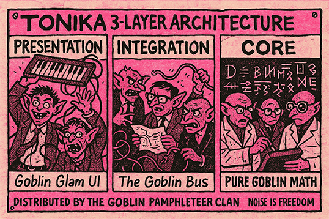
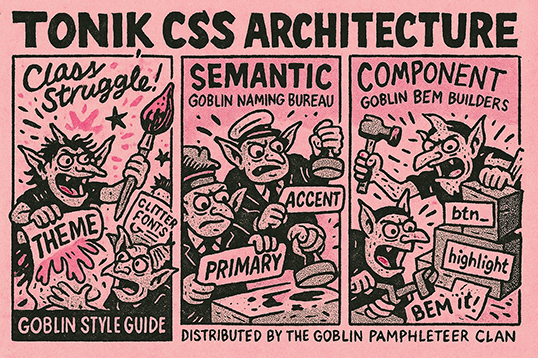
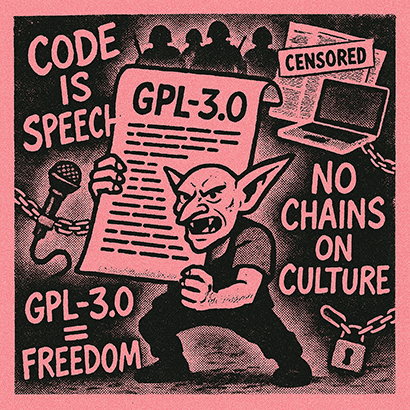

# Tonika

[](https://coveralls.io/github/aa-parky/tonika_bus?branch=development)

|  |  |  
|-----------------------------------------------------------------------|-------------------------------------------------------------------|

Tonika began as a pile of personal hacks, half-broken goblin tools I built to keep music close.  
Over time those scraps grew teeth, and now they've marched out into the world as a full rack of militant little modules.

This project is about more than code. It's about music as resistance, about goblins with shovels digging up songs from the dirt, about noise as solidarity, about sound as a way to shout back at power.

We take inspiration from Oliver Postgate and Peter Firmin: small productions with huge hearts, stories that smuggle in politics and protest under the cover of whimsy. Every Tonika module follows Goblin Law: no fat orcs, keep the guest list clean, never meddle in another goblin's guts. Each does one job well, but together they form an ecosystem where creativity and defiance are inseparable.

Tonika is proudly GPL-3. That's not just a license; it's a manifesto. These tools belong to everyone. Fork them, bend them, let them misbehave. Goblins don't build for profit or prestige. We build to share, to equip, to make noise that matters.

It provides a rack-like architecture where each module is self-contained but communicates through a shared Bus.

---

## Community Guidelines

### Contributing Philosophy

This is a **personal consolidation project first**, community platform second. The foundation needs to be solid before opening to external contributions.

## Background

**Tonika Problem Statement**

Music is immediate. Pick up an acoustic instrument, strike a key, pluck a string, hit a surface—sound happens. No menus, no cables, no setup. Just instant feedback. Even with no training, repetition turns noise into rhythm, memory into patterns, and patterns into music. That immediacy is what draws us back: the direct, unfiltered link between human and sound.

Digital music production too often breaks this link. Instead of immediacy, it offers complexity—layers of software, configuration, presets, and plugins that overwhelm and obstruct. The joy of creation is buried under friction.

Tonika exists to strip away that friction. It reduces sound-making to its core elements: simple, direct, always-on, and as minimal as the player desires. Tonika is designed to replicate the immediacy of the acoustic world in the digital domain—providing a space for uninterrupted creativity, whether you want a focused practice tool or a playful doom-scrolling rack of user-created sounds.

Tonika is not here to prescribe how music _should_ be made. It is here to give you the tools—open, modular, and yours to use as you please. Your noise becomes your music.

---

## Tonika Vision Statement

Tonika believes music belongs to everyone. Sound should be as accessible and immediate as breath, not gated by complexity or locked behind software walls.

Our vision is a world where digital instruments feel as direct as acoustic ones: pick it up, play, and create. Where technology supports creativity without demanding obedience. Where experimentation, noise, and play are celebrated as much as virtuosity.

Tonika builds modular, open tools that are always on, always ready, and always yours. By stripping music-making back to its elemental parts, we create a space where noise becomes rhythm, rhythm becomes memory, and memory becomes music.

Tonika is for the curious, the restless, the rebels, and the dreamers. It is for those who want immediacy, freedom, and joy in sound.

Noise is the seed. Music is the path. Tonika is the bridge.

---

## Architecture Overview

Tonika is built on a **modular, event-driven architecture** that prioritizes simplicity, decoupling, and extensibility. At its heart is the **Tonika Bus**—a centralized event broker that enables complete separation between modules.

### The Three-Layer Philosophy

```
┌─────────────────────────────────────────────────────────────────────────────┐
│                          PRESENTATION LAYER                                 │
│         (Tonika UI components, demos, visual interfaces)                    │
├─────────────────────────────────────────────────────────────────────────────┤
│                           INTEGRATION LAYER                                 │
│             (Bus system, adapters for mido, music21, etc.)                  │
├─────────────────────────────────────────────────────────────────────────────┤
│                              CORE LAYER                                     │
│             (Pure event system, module lifecycle, no dependencies)          │
└─────────────────────────────────────────────────────────────────────────────┘
```



**Core Layer:** The Tonika Bus provides event routing, module lifecycle management, and pub/sub messaging. It has zero runtime dependencies and is fully tested (106 tests, 93% coverage).

**Integration Layer:** Adapters will wrap mature libraries like `mido` (MIDI I/O), `python-rtmidi` (low-level MIDI), and `music21` (music theory). These adapters will emit events to the Bus, keeping the core clean and focused.

**Presentation Layer:** UI components, visualizers, and user-facing modules will subscribe to Bus events and present information or controls. The presentation layer will never directly call core or integration code—everything flows through events.

---

## The Tonika Bus 🚌

The **Tonika Bus** is the communication backbone of Tonika. It implements a **publish-subscribe pattern** where modules emit events without knowing who's listening, and subscribe to events without knowing who's sending.

### Why the Bus?

**Traditional approach (tight coupling):**
```python
class Sequencer:
    def __init__(self, synth, recorder, visualizer):
        self.synth = synth
        self.recorder = recorder
        self.visualizer = visualizer
    
    def play_note(self, note):
        self.synth.play(note)          # Direct call
        self.recorder.record(note)      # Direct call
        self.visualizer.show(note)      # Direct call
```

**Problems:**
- Sequencer tightly coupled to 3 modules
- Hard to add new listeners
- Can't swap implementations
- Difficult to test

**Bus approach (decoupled):**
```python
class Sequencer(TonikaModule):
    def play_note(self, note):
        self.emit("midi:note-on", {"note": note})  # Just emit!

class Synth(TonikaModule):
    async def _initialize(self):
        self.on("midi:note-on", self.play)

class Recorder(TonikaModule):
    async def _initialize(self):
        self.on("midi:note-on", self.record)
```

**Benefits:**
- Zero coupling between modules
- Easy to add new listeners
- Simple to swap implementations
- Trivial to test

### Quick Example

```python
import asyncio
from tonika_bus import TonikaBus, TonikaModule

class PianoGoblin(TonikaModule):
    """Plays piano keys"""
    def play_key(self, note):
        print(f"🎹 Playing note {note}")
        self.emit("midi:note-on", {"note": note})

class SynthGoblin(TonikaModule):
    """Makes sounds"""
    async def _initialize(self):
        self.on("midi:note-on", self.make_sound)
    
    def make_sound(self, event):
        note = event.detail["note"]
        print(f"🔊 BEEP! (note {note})")

async def main():
    piano = PianoGoblin(name="Piano", version="1.0.0")
    synth = SynthGoblin(name="Synth", version="1.0.0")
    
    await piano.init()
    await synth.init()
    
    piano.play_key(60)  # Middle C
    
    piano.destroy()
    synth.destroy()

asyncio.run(main())
```

**Output:**
```
🎹 Playing note 60
🔊 BEEP! (note 60)
```

**Notice:** Piano doesn't know about Synth! They communicate through the Bus! 🎯

---

## Current Project Structure

```


tonika_bus/                          # ✅ COMPLETE - Core event system
├── src/
│   └── tonika_bus/                  # Main package
│       ├── __init__.py              # Package exports
│       └── core/                    # Core components
│           ├── __init__.py          # Core exports
│           ├── bus.py               # TonikaBus singleton
│           ├── module.py            # TonikaModule base class
│           └── events.py            # Event structures
│
├── tests/                           # ✅ 82 tests
│   ├── __init__.py
│   ├── conftest.py                  # Shared fixtures
│   ├── test_bus.py                  # Bus tests (44 tests)
│   ├── test_events.py               # Event tests (35 tests)
│   └── test_module.py               # Module tests (3 tests)
│
├── examples/                        # Working examples
│   ├── example_1_simple_counter_module.py
│   ├── example_2_midi_like_system.py
│   ├── example_3_request_response.py
│   └── example_4_module_dependencies.py
│
├── docs/                            # Documentation
│   ├── conf.py                      # Sphinx configuration
│   ├── index.rst                    # Documentation index
│   ├── tonika_bus_readme.md         # Detailed Bus docs
│   ├── goblin-laws.md               # Design principles
│   └── examples.md                  # Example documentation
│
├── htmlcov/                         # Coverage reports
├── pyproject.toml                   # Package configuration
├── LICENSE                          # GPL-3.0
└── README.md                        # This file


```

### Future Structure (Planned)

```
tonika_bus/                          # ✅ COMPLETE
│
├── examples/                        # 📋 PLANNED - Working examples
│   ├── 01_simple_counter.py
│   ├── 02_musical_goblins.py
│   ├── 03_request_response.py
│   └── 04_midi_echo.py
│
└── adapters/                        # 📋 PLANNED - Integration layer
    ├── __init__.py
    ├── midi/                        # MIDI adapters (mido)
    │   ├── __init__.py
    │   ├── input.py                 # MIDI input adapter
    │   ├── output.py                # MIDI output adapter
    │   └── file.py                  # MIDI file adapter
    │
    └── theory/                      # Music theory (music21)
        ├── __init__.py
        ├── chord_analyzer.py        # Chord detection
        └── scale_analyzer.py        # Scale detection
```

---

## Getting Started

### Installation

```bash
# Clone the repository
git clone https://github.com/aa-parky/tonika_bus.git
cd tonika_bus

# Install with all dependencies
pip install -e ".[all]"

# Or install just the core
pip install -e .
```

### Verify Installation

```bash
# Run tests
pytest

# With coverage
pytest --cov

# Quick test
python -c "from tonika_bus import TonikaBus; print('✅ Tonika Bus installed!')"
```

### Your First Module

Create a file `my_first_goblin.py`:

```python
import asyncio
from tonika_bus import TonikaBus, TonikaModule

class CounterGoblin(TonikaModule):
    async def _initialize(self):
        self.count = 0
        self.on("counter:increment", self.increment)
        self.on("counter:reset", self.reset)
    
    def increment(self, event):
        amount = event.detail.get("amount", 1)
        self.count += amount
        self.emit("counter:changed", {"count": self.count})
        print(f"🔢 Count: {self.count}")
    
    def reset(self, event):
        self.count = 0
        self.emit("counter:changed", {"count": self.count})
        print(f"🔄 Reset to 0")

async def main():
    bus = TonikaBus()
    counter = CounterGoblin(name="Counter", version="1.0.0")
    await counter.init()
    
    # Increment a few times
    bus.emit("counter:increment", {"amount": 5})
    bus.emit("counter:increment", {"amount": 3})
    bus.emit("counter:increment", {"amount": 2})
    
    # Reset
    bus.emit("counter:reset", {})
    
    # Cleanup
    counter.destroy()

asyncio.run(main())
```

Run it:
```bash
python my_first_goblin.py
```

Output:
```
🔢 Count: 5
🔢 Count: 8
🔢 Count: 10
🔄 Reset to 0
```

---

## Goblin Laws 🧌

Every Tonika module follows ancient Goblin Laws to keep the code clean and maintainable:


### Goblin Law #37: Never Meddle in Another Goblin's Guts

**Rule:** Modules must NEVER directly access or modify another module's internal state.

**Enforcement:** The Bus is the ONLY communication channel between modules.

```python
# ❌ FORBIDDEN - Violation of Law #37
synth = bus.get_module("Synth")
synth.oscillator.frequency = 440  # Direct meddling! BAD!

# ✅ REQUIRED - Compliance with Law #37
bus.emit("synth:frequency:set", {"frequency": 440})
```

---

### Goblin Law #41: Only One Drumbeat of Readiness

**Rule:** Only the base `TonikaModule` class emits lifecycle events (`module:initializing`, `module:ready`, `module:error`, `module:destroyed`).

**Enforcement:** Subclasses override `_initialize()`, NOT `init()`.

```python
# ❌ FORBIDDEN - Violation of Law #41
class BadGoblin(TonikaModule):
    async def init(self):
        self.emit("module:ready", {})  # DON'T override init()!

# ✅ REQUIRED - Compliance with Law #41
class GoodGoblin(TonikaModule):
    async def _initialize(self):
        # Custom setup here
        self.emit("synth:voice-allocated", {})  # Domain events OK!
```

---

### Goblin Law #7: No Fat Orcs

**Rule:** Each module does ONE thing well.

**Guidance:** If a module is doing too many things, split it into multiple modules that communicate via the Bus.

```python
# ❌ BAD - Fat Orc doing everything
class MegaModule(TonikaModule):
    async def _initialize(self):
        self.play_midi()
        self.record_audio()
        self.analyze_chords()
        self.draw_visualizations()
        # TOO MUCH!

# ✅ GOOD - Lean Goblins, each with one job
class MidiPlayer(TonikaModule): ...
class AudioRecorder(TonikaModule): ...
class ChordAnalyzer(TonikaModule): ...
class Visualizer(TonikaModule): ...
```

---

### Goblin Law #8: All Goblins Are Boundary Guards

**Rule:** Every module that touches the "outside world" (hardware, files, network) must immediately report to the Bus.

```python
# ✅ GOOD - Boundary guard reports immediately
class MidiInputModule(TonikaModule):
    def handle_hardware_midi(self, note):
        # Got note from real MIDI keyboard
        self.emit("midi:note-on", {"note": note})  # Tell the Bus!

# ❌ BAD - Boundary guard keeps secrets
class MidiInputModule(TonikaModule):
    def handle_hardware_midi(self, note):
        self.internal_buffer.append(note)  # Keeping it secret!
        # Bus doesn't know! BAD!
```

**Full Goblin Laws:** See [docs/goblin-laws.md](docs/goblin-laws.md) (if available)

---

## Integration Strategy

Tonika **integrates, not reinvents**. We leverage mature, well-tested libraries and wrap them in clean adapters.

### Why Integration?

**The Problem:** Reimplementing MIDI parsing, music theory, and audio processing is:
- Time-consuming
- Error-prone
- Already solved by mature libraries

**The Solution:** Use existing GPL-3 compatible libraries and provide clean Bus adapters.

### Planned Integrations

#### MIDI: mido + python-rtmidi

**Why?** Both are GPL-3 compatible, mature, and handle MIDI complexity.

**Our role:** Provide adapters that emit Bus events.

```python
# Future: adapters/midi/input.py
class MidiInputAdapter(TonikaModule):
    async def _initialize(self):
        self.port = mido.open_input()
        asyncio.create_task(self._poll_midi())
    
    async def _poll_midi(self):
        for msg in self.port:
            self.emit("midi:message", {
                "type": msg.type,
                "note": msg.note,
                "velocity": msg.velocity
            })
```

#### Music Theory: music21

**Why?** MIT-developed, comprehensive, GPL-3 compatible.

**Our role:** Provide adapters for chord analysis, scale detection, etc.

```python
# Future: adapters/theory/chord_analyzer.py
class ChordAnalyzer(TonikaModule):
    async def _initialize(self):
        self.on("midi:notes", self.analyze)
    
    def analyze(self, event):
        notes = event.detail["notes"]
        chord = music21.chord.Chord(notes)
        self.emit("theory:chord", {
            "name": chord.commonName,
            "root": chord.root().name
        })
```

---

## Development Status

### ✅ Phase 1: Core Foundation (COMPLETE)

- **Tonika Bus** - Event system with pub/sub messaging
  - `TonikaBus` singleton
  - `TonikaModule` base class
  - Event structures (`TonikaEvent`, `EventMetadata`, `ModuleStatus`)
  - Full async support
  - Module lifecycle management
  - Event logging and debugging
  - **106 tests, 93% coverage** ⚡
  - All tests passing in < 1 second

### 🚧 Phase 2: Integration Layer (IN PROGRESS)

- **MIDI Adapters** (planned)
  - Input adapter (mido)
  - Output adapter (mido)
  - File adapter (mido)
  
- **Music Theory Adapters** (planned)
  - Chord analyzer (music21)
  - Scale analyzer (music21)

- **Example Modules** (planned)
  - Simple counter (learning example)
  - Musical goblins (multi-module demo)
  - MIDI echo (real MIDI I/O)
  - Chord recognition (theory integration)

### 📋 Phase 3: Presentation Layer (PLANNED)

- **Tonika UI** (future)
  - Web-based rack interface
  - Visual module components
  - Theme system
  
- **Plugin System** (future)
  - User-contributed modules
  - Module discovery
  - Hot-reloading

---

## Testing

The Bus is thoroughly tested with 106 tests covering all functionality.

### Running Tests

```bash
# Run all tests
pytest

# With coverage report
pytest --cov

# Verbose output
pytest -v

# Only unit tests (fast)
pytest -m unit

# Only integration tests
pytest -m integration

# Generate HTML coverage report
pytest --cov --cov-report=html
open htmlcov/index.html
```

### Test Coverage

```


Name                Coverage
----------------------------------
src/tonika_bus/core/bus.py       99%
src/tonika_bus/core/events.py   100%
src/tonika_bus/core/module.py    98%
----------------------------------
TOTAL                            99%


```

**82 tests, 99% coverage, all passing in < 1 second** ⚡

---

## Documentation

### Available Documentation

- **[Tonika Bus README](docs/tonika_bus_readme.md)** - Detailed Bus documentation
- **This README** - Overview and getting started
- **Code Examples** - See `src/tonika_bus/core/example_usage.py`
- **Test Examples** - See `tests/` directory for usage patterns

### Planned Documentation

- **Goblin Laws** - Complete list with examples (docs/goblin-laws.md)
- **API Reference** - Full API documentation
- **Integration Guide** - How to build adapters
- **Module Development Guide** - How to create modules
- **Architecture Deep Dive** - Design decisions and patterns

### Theme Architecture

For future UI development:


```
┌─────────────────────────────────────────────────────────┐
│                    THEME LAYER                          │
│            (Actual colors, fonts, spacing)              │
├─────────────────────────────────────────────────────────┤
│                   SEMANTIC LAYER                        │
│        (What things mean: primary, accent, muted)       │
├─────────────────────────────────────────────────────────┤
│                  COMPONENT LAYER                        │
│         (How modules use semantic meanings)             │
└─────────────────────────────────────────────────────────┘
```



---

## Contributing

This is a **personal consolidation project first**, community platform second. The foundation needs to be solid before opening to external contributions.

### Current Phase: Foundation Building

We're focused on:
- ✅ Solidifying the Bus architecture (COMPLETE)
- 🚧 Building core adapters (MIDI, theory)
- 🚧 Creating example modules
- 📋 Writing comprehensive documentation

### Future Phase: Community Opening

Once the foundation is stable, we'll open for:
- Plugin contributions
- Module submissions
- Theme contributions
- Documentation improvements

### How to Help Now

- **Test the Bus** - Build modules and report issues
- **Provide Feedback** - Share your experience with the architecture
- **Spread the Word** - Tell other goblins about Tonika!
- **Document Your Experiments** - Share what you build

---

## Philosophy

### Music as Resistance

Tonika is not neutral. We believe music is a form of resistance, a way to shout back at power, a tool for solidarity. Every line of code is written with this in mind.

### Open by Default

GPL-3 is not just a license—it's a manifesto. These tools belong to everyone. Fork them, bend them, let them misbehave. Goblins don't build for profit or prestige. We build to share, to equip, to make noise that matters.

### Simplicity Over Features

We resist feature creep. Each module does one thing well. The Bus connects them. That's it. No bloat, no fat orcs.

### Immediacy Over Complexity

Digital music should feel as immediate as acoustic instruments. Pick it up, play, create. No menus, no setup, no friction.

### Integration Over Reinvention

We stand on the shoulders of giants. Rather than rebuild what exists, we integrate mature libraries (mido, music21) and provide clean, event-driven interfaces. Our value is in the architecture, not reimplementing MIDI parsers.

---

## License



**GPL-3.0** © 2023–2025 aa-parky

This program is free software: you can redistribute it and/or modify it under the terms of the GNU General Public License as published by the Free Software Foundation, either version 3 of the License, or (at your option) any later version.

This program is distributed in the hope that it will be useful, but WITHOUT ANY WARRANTY; without even the implied warranty of MERCHANTABILITY or FITNESS FOR A PARTICULAR PURPOSE. See the GNU General Public License for more details.

You should have received a copy of the GNU General Public License along with this program. If not, see <https://www.gnu.org/licenses/>.

---

## Links

- **Repository:** [https://github.com/aa-parky/tonika_bus](https://github.com/aa-parky/tonika_bus)
- **Issues:** [https://github.com/aa-parky/tonika_bus/issues](https://github.com/aa-parky/tonika_bus/issues)
- **Main Tonika Project:** [https://github.com/aa-parky/tonika](https://github.com/aa-parky/tonika) (if separate)

---

## Quick Start Summary

```bash
# 1. Install
git clone https://github.com/aa-parky/tonika_bus.git
cd tonika_bus
pip install -e ".[all]"

# 2. Test
pytest

# 3. Try it
python -c "from tonika_bus import TonikaBus; print('✅ Ready!')"

# 4. Build something!
# See examples in docs/tonika_bus_readme.md
```

---

**🧌 Now go make some noise with your Goblins! 🎵**

*Remember: Never Meddle in Another Goblin's Guts!* — Goblin Law #37
