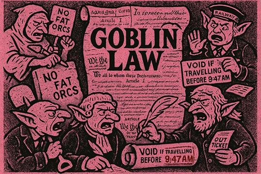

# Tonika Bus

[](https://github.com/aa-parky/tonika_bus/actions)
[](https://coveralls.io/github/aa-parky/tonika_bus?branch=main)
[](https://tonika-bus.readthedocs.io/en/latest/)
[](https://www.gnu.org/licenses/gpl-3.0)
[](https://www.python.org/downloads/)

|  |  |  
|-----------------------------------------------------------------------|-------------------------------------------------------------------|

**Event-driven message broker for modular music production.**

Tonika began as a pile of personal hacks, half-broken goblin tools I built to keep music close. Over time those scraps grew teeth, and now they've marched out into the world as a full rack of militant little modules.

This project is about more than code. It's about music as resistance, about goblins with shovels digging up songs from the dirt, about noise as solidarity, about sound as a way to shout back at power.

We take inspiration from Oliver Postgate and Peter Firmin: small productions with huge hearts, stories that smuggle in politics and protest under the cover of whimsy. Every Tonika module follows Goblin Law: no fat orcs, keep the guest list clean, never meddle in another goblin's guts. Each does one job well, but together they form an ecosystem where creativity and defiance are inseparable.

Tonika is proudly GPL-3. That's not just a license; it's a manifesto. These tools belong to everyone. Fork them, bend them, let them misbehave. Goblins don't build for profit or prestige. We build to share, to equip, to make noise that matters.

---

## Table of Contents

- [Community Guidelines](#community-guidelines)
- [What is Tonika?](#what-is-tonika)
- [Architecture Overview](#architecture-overview)
- [Getting Started](#getting-started)
- [Integration Strategy](#integration-strategy)
- [Documentation](#documentation)
- [Philosophy](#philosophy)
- [Contributing](#contributing)
- [License](#license)
- [Links](#links)

---

## Community Guidelines

This is a **personal consolidation project first**, community platform second. The foundation needs to be solid before opening to external contributions.

**Current Phase:** Foundation building - solidifying the Bus architecture, creating adapters, and establishing documentation patterns.

**Future Phase:** Once stable, we'll welcome plugin contributions, module submissions, theme contributions, and documentation improvements.

See [CONTRIBUTING.md](CONTRIBUTING.md) for guidelines on how to help now.

---

## What is Tonika?

### The Problem

Music is immediate. Pick up an acoustic instrument, strike a key, pluck a string, hit a surface—sound happens. No menus, no cables, no setup. Just instant feedback. Even with no training, repetition turns noise into rhythm, memory into patterns, and patterns into music. That immediacy is what draws us back: the direct, unfiltered link between human and sound.

Digital music production too often breaks this link. Instead of immediacy, it offers complexity—layers of software, configuration, presets, and plugins that overwhelm and obstruct. The joy of creation is buried under friction.

### The Solution

Tonika exists to strip away that friction. It reduces sound-making to its core elements: simple, direct, always-on, and as minimal as the player desires. Tonika is designed to replicate the immediacy of the acoustic world in the digital domain—providing a space for uninterrupted creativity, whether you want a focused practice tool or a playful doom-scrolling rack of user-created sounds.

Tonika is not here to prescribe how music _should_ be made. It is here to give you the tools—open, modular, and yours to use as you please.

**Your noise becomes your music.**

### Vision

Tonika believes music belongs to everyone. Sound should be as accessible and immediate as breath, not gated by complexity or locked behind software walls.

Our vision is a world where digital instruments feel as direct as acoustic ones: pick it up, play, and create. Where technology supports creativity without demanding obedience. Where experimentation, noise, and play are celebrated as much as virtuosity.

Tonika builds modular, open tools that are always on, always ready, and always yours. By stripping music-making back to its elemental parts, we create a space where noise becomes rhythm, rhythm becomes memory, and memory becomes music.

**Tonika is for the curious, the restless, the rebels, and the dreamers.** It is for those who want immediacy, freedom, and joy in sound.

---

## Architecture Overview

Tonika is built on a **modular, event-driven architecture** that prioritizes simplicity, decoupling, and extensibility. At its heart is the **Tonika Bus**—a centralized event broker that enables complete separation between modules.

### The Three-Layer Philosophy

```
┌─────────────────────────────────────────────────────────────────────────────┐
│                          PRESENTATION LAYER                                 │
│         (Tonika UI components, demos, visual interfaces)                    │
├─────────────────────────────────────────────────────────────────────────────┤
│                           INTEGRATION LAYER                                 │
│             (Bus system, adapters for mido, music21, etc.)                  │
├─────────────────────────────────────────────────────────────────────────────┤
│                              CORE LAYER                                     │
│             (Pure event system, module lifecycle, no dependencies)          │
└─────────────────────────────────────────────────────────────────────────────┘
```


**Core Layer:** The Tonika Bus provides event routing, module lifecycle management, and pub/sub messaging. It has **zero runtime dependencies** and is fully tested.

**Integration Layer:** Adapters wrap mature libraries like `mido` (MIDI I/O), `python-rtmidi` (low-level MIDI), and `music21` (music theory). These adapters emit events to the Bus, keeping the core clean and focused.

**Presentation Layer:** UI components, visualizers, and user-facing modules subscribe to Bus events and present information or controls. The presentation layer never directly calls core or integration code—everything flows through events.

### Why Event-Driven?

**Traditional approach (tight coupling):**
```python
class Sequencer:
    def __init__(self, synth, recorder, visualizer):
        self.synth = synth          # Direct dependency
        self.recorder = recorder    # Direct dependency
        self.visualizer = visualizer # Direct dependency
```

**Problems:** Tightly coupled, hard to test, difficult to extend.

**Bus approach (decoupled):**
```python
class Sequencer(TonikaModule):
    def play_note(self, note):
        self.emit("midi:note-on", {"note": note})  # Just emit!

class Synth(TonikaModule):
    async def _initialize(self):
        self.on("midi:note-on", self.play)  # Subscribe
```

**Benefits:** Zero coupling, easy to test, trivial to extend.

---

## Getting Started

### Requirements

- **Python:** 3.11 or higher
- **Operating System:** Linux, macOS, or Windows
- **Dependencies:** None for core Bus (optional dependencies for adapters)

### Installation

**Clone the repository:**
```bash
git clone https://github.com/aa-parky/tonika_bus.git
cd tonika_bus
```

**Install the core Bus (no dependencies):**
```bash
pip install -e .
```

**Or install with optional dependencies:**

```bash
# Development tools (testing, linting, docs)
pip install -e ".[dev]"

# MIDI support (mido + python-rtmidi)
pip install -e ".[midi]"

# Music theory support (music21)
pip install -e ".[theory]"

# All MIDI and theory adapters
pip install -e ".[adapters]"

# Everything (adapters + dev tools)
pip install -e ".[all]"
```

### Verify Installation

```bash
# Quick verification
python -c "from tonika_bus import TonikaBus; print('✅ Tonika Bus ready!')"

# Run tests
pytest

# Run tests with coverage
pytest --cov
```

### Quick Example

```python
import asyncio
from tonika_bus import TonikaBus, TonikaModule

class PianoGoblin(TonikaModule):
    """Plays piano keys"""
    def play_key(self, note):
        print(f"🎹 Playing note {note}")
        self.emit("midi:note-on", {"note": note})

class SynthGoblin(TonikaModule):
    """Makes sounds"""
    async def _initialize(self):
        self.on("midi:note-on", self.make_sound)
    
    def make_sound(self, event):
        note = event.detail["note"]
        print(f"🔊 BEEP! (note {note})")

async def main():
    piano = PianoGoblin(name="Piano", version="1.0.0")
    synth = SynthGoblin(name="Synth", version="1.0.0")
    
    await piano.init()
    await synth.init()
    
    piano.play_key(60)  # Middle C
    
    piano.destroy()
    synth.destroy()

asyncio.run(main())
```

**Output:**
```
🎹 Playing note 60
🔊 BEEP! (note 60)
```

**Notice:** Piano doesn't know about Synth! They communicate through the Bus! 🎯

---

## Integration Strategy

Tonika **integrates, not reinvents**. We leverage mature, well-tested libraries and wrap them in clean adapters that emit Bus events.

### Why Integration?

**The Problem:** Reimplementing MIDI parsing, music theory, and audio processing is time-consuming, error-prone, and already solved by mature libraries.

**The Solution:** Use existing GPL-3 compatible libraries and provide clean Bus adapters.

### Libraries We Use

**MIDI:**
- [`mido`](https://mido.readthedocs.io/) - MIDI objects for Python (MIT License, GPL-3 compatible)
- [`python-rtmidi`](https://pypi.org/project/python-rtmidi/) - Python bindings for RtMidi (MIT License, GPL-3 compatible)

**Music Theory:**
- [`music21`](https://web.mit.edu/music21/) - Toolkit for computational musicology (BSD License, GPL-3 compatible)

**Audio Processing:**
- TBD - Exploring options (will be GPL-3 compatible)

### Our Value-Add

We provide **clean event-driven adapters** that:
- Emit standardized Bus events
- Handle edge cases and errors gracefully
- Maintain zero coupling between modules
- Enable hot-swapping of implementations

For planned adapter implementations, see [ROADMAP.md](docs/ROADMAP.md).

---

## Documentation

### Core Documentation

- **[Bus Architecture Guide](docs/BUS_GUIDE.md)** - Detailed Bus documentation
- **[Writing Your First Module](docs/FIRST_MODULE.md)** - Step-by-step tutorial
- **[Goblin Laws with Examples](docs/goblin_laws_examples.md)** - Design principles and code patterns
- **[Testing Guide](docs/TESTING.md)** - How to test your modules
- **[API Reference](https://tonika-bus.readthedocs.io/)** - Full API documentation (Read the Docs)

### Examples

Working examples are in the [examples](examples)directory:
- `example_1_simple_counter_module.py` - Basic module creation
- `example_2_midi_like_system.py` - MIDI-style event handling
- `example_3_request_response.py` - Request/response patterns
- `example_4_module_dependencies.py` - Module communication and dependencies

### Development Documentation

- **[CONTRIBUTING.md](CONTRIBUTING.md)** - Contribution guidelines
- **[CHANGELOG.md](CHANGELOG.md)** - Version history and changes
- **[ROADMAP.md](docs/ROADMAP.md)** - Planned features and timeline

---

## Philosophy



### Music as Resistance

Tonika is not neutral. We believe music is a form of resistance, a way to shout back at power, a tool for solidarity. Every line of code is written with this in mind.

Music is immediate and visceral. It bypasses argument and goes straight to the body, the heart, the gut. When words fail, when systems oppress, when power consolidates—music cuts through. It carries memory, signals defiance, builds community.

Tonika exists because digital music tools have become gatekeepers rather than enablers. Complexity has replaced immediacy. Licensing has replaced sharing. Consumption has replaced creation.

We reject this. Tonika is built on the principle that everyone has the right to make noise, to experiment, to create without permission or profit motive. These tools are not products to be sold. They are infrastructure for resistance, shared freely, improved collectively.

### Open by Default

GPL-3 is not just a license—it's a manifesto. These tools belong to everyone. Fork them, bend them, let them misbehave. Goblins don't build for profit or prestige. We build to share, to equip, to make noise that matters.

**What this means in practice:**

- **Source code is always available** - No black boxes, no proprietary extensions
- **Forks are encouraged** - Take it in new directions
- **Contributions stay free** - GPL-3 ensures downstream freedom
- **Commercial use is allowed** - But you must share your modifications
- **Community over company** - No venture capital, no exit strategy

### Simplicity Over Features

We resist feature creep. Each module does one thing well. The Bus connects them. That's it. No bloat, no fat orcs.

When faced with a choice between adding a feature or keeping the system simple, we choose simplicity. Complexity is debt. Simplicity is freedom.

### Immediacy Over Complexity

Digital music should feel as immediate as acoustic instruments. Pick it up, play, create. No menus, no setup, no friction.

Every design decision is measured against this principle: Does it reduce friction? Does it increase immediacy? Does it get out of the way?

### Integration Over Reinvention

We stand on the shoulders of giants. Rather than rebuild what exists, we integrate mature libraries (mido, music21) and provide clean, event-driven interfaces.

Our value is in the architecture, not in reimplementing MIDI parsers or music theory algorithms. We curate, connect, and simplify.

---

## Contributing

We welcome contributions! However, this is a **personal consolidation project first**, community platform second. The foundation needs to be solid before opening to external contributions.

**Current Status:** Foundation building phase. Core Bus is stable, but adapters and UI are still in development.

**How to Help Now:**
- **Test the Bus** - Build modules and report issues
- **Provide Feedback** - Share your experience with the architecture  
- **Spread the Word** - Tell other goblins about Tonika
- **Document Your Experiments** - Share what you build

For detailed contribution guidelines, code style, and development setup, see **[CONTRIBUTING.md](CONTRIBUTING.md)**.

---

## License


**GNU General Public License v3.0 or later**

Copyright © 2023–2025 aa-parky

This program is free software: you can redistribute it and/or modify it under the terms of the GNU General Public License as published by the Free Software Foundation, either version 3 of the License, or (at your option) any later version.

This program is distributed in the hope that it will be useful, but WITHOUT ANY WARRANTY; without even the implied warranty of MERCHANTABILITY or FITNESS FOR A PARTICULAR PURPOSE. See the GNU General Public License for more details.

You should have received a copy of the GNU General Public License along with this program. If not, see <https://www.gnu.org/licenses/>.

---

## Links

- **Repository:** [github.com/aa-parky/tonika_bus](https://github.com/aa-parky/tonika_bus)
- **Documentation:** [tonika-bus.readthedocs.io](https://tonika-bus.readthedocs.io/)
- **Issues:** [github.com/aa-parky/tonika_bus/issues](https://github.com/aa-parky/tonika_bus/issues)
- **Main Tonika Project:** [github.com/aa-parky/tonika](https://github.com/aa-parky/tonika)
- **Changelog:** [CHANGELOG.md](CHANGELOG.md)
- **Roadmap:** [ROADMAP.md](docs/ROADMAP.md)

---

**🧌 Now go make some noise with your Goblins! 🎵**

*Remember: Never Meddle in Another Goblin's Guts!* — Goblin Law #37
